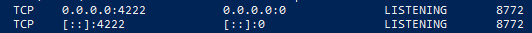

# Pacote `cmd/all-in-one`

A ser documentado.

Mas por enquanto, aqui vão alguns exemplos:

```terminal
$ nats-server -D -js
$ nats -s localhost:4222 stream create payments --subjects "payment.process" --storage memory --replicas 1 --retention=limits --discard=old --max-msgs 1_000_000 --max-msgs-per-subject 100_000 --max-bytes 4GiB --max-age 1d --max-msg-size 10MiB --dupe-window 2m --allow-rollup --no-deny-delete --no-deny-purge
$ go run ./cmd/all-in-one/
$ curl localhost:8080/payments
$ curl -X POST localhost:8080/users -d '{"id": "jpkroehling"}'
$ curl -X POST localhost:8080/subscriptions -d '{"id": "jpkroehling", "user_id":"jpkroehling", "plan_id":"silver"}'
$ curl -X POST localhost:8080/payments -d '{"id": "some-uuid", "subscription_id":"jpkroehling", "amount":99, "status":"FAILED"}'
$ nats -s localhost:4222 stream view payments
```
## Iniciar infra com docker-compose

```terminal
$ docker compose -f $ROOT_PATH/docker/docker-compose.yml up -d
```

## Corrigindo possíveis erros ao executar o all-in-one localmente no Windows

### GO

- O módulo all-in-one utiliza a biblioteca `go-sqlite3` como dependência, que requer o CGO ativado para funcionar. Dessa forma, ao executá-lo o usuário poderá se deparar com o seguinte erro:  

```terminal
[error] failed to initialize database, got error Binary was compiled with 'CGO_ENABLED=0', go-sqlite3 requires cgo to work. This is a stub
panic: Binary was compiled with 'CGO_ENABLED=0', go-sqlite3 requires cgo to work. This is a stub
```

- Outro possível erro está relacionado a ausência do GCC, que é uma dependência do SQLite:

```terminal
⨯ build failed after 2m23s error=build failed: failed to build for windows_amd64_v1: exit status 1: # runtime/cgo
cgo: C compiler "gcc" not found: exec: "gcc": executable file not found in %PATH%
target: windows_amd64_v1
```

#### Correções

- Instale o [MinGW-w64](https://winlibs.com/) para corrigir o erro relacionado à ausência do GCC (Não esqueça de adicioná-lo ao PATH).
- Altere a etapa de build no arquivo `.goreleaser.yaml` para habilitar a variável CGO_ENABLED e especificar o SO na qual a release será compilada.    

Ele ficará assim:

```
builds:
  - id: users
    main: ./cmd/users
    binary: users
    env:
      - CGO_ENABLED=1
    goos:
      - windows
    goarch:
      - amd64
      

  - id: plans
    main: ./cmd/plans
    binary: plans
    env:
      - CGO_ENABLED=1
    goos:
      - windows
    goarch:
      - amd64
      

  - id: subscriptions
    main: ./cmd/subscriptions
    binary: subscriptions
    env:
      - CGO_ENABLED=1
    goos:
      - windows
    goarch:
      - amd64
      
    
  - id: payments
    main: ./cmd/payments
    binary: payments
    env:
      - CGO_ENABLED=1
    goos:
      - windows
    goarch:
      - amd64

```

Após a alteração, execute o seguinte comando para testar localmente a nova release:

`goreleaser build --snapshot --clean`

Se tudo ocorrer corretamente, crie a nova release de maneira definitiva:

`goreleaser release --snapshot --clean`

### Nats/Nats-server

- O Nats-server utiliza por padrão a porta 4222 durante a sua execução. Caso algum outro processo esteja utilizando essa mesma porta, poderá ocorrer o seguinte erro ao tentar iniciar o servidor Nats:

```terminal
nats: Error listening on port: 0.0.0.0:4222, "listen tcp 0.0.0.0:4222: 
bind: Normalmente é permitida apenas uma utilização de cada endereço de soquete (protocolo/endereço de rede/porta)."
```

- Após iniciar o Nats-server, ao tentar executar o módulo all-in-one, poderá ocorrer o seguinte erro: 

`nats: panic: nats: no responders available for request`

#### Solução

- Abra o Powershell e valide se existe algum processo executando na porta 4222, utilizando o seguinte comando: `netstat -ano | findstr :4222`

Caso o resultado seja semelhante ao da imagem, é sinal de que existe um processo utilizando a porta 4222.




Mate o processo em execução ou altere a porta utilizada pelo Nats-Server. 

Caso seja necessário alterar a porta de execução do servidor Nats, informe a nova porta no bloco de configuração do Nats, no arquivo `./internal/config/config.go`.
```
			NATS: NATS{
				Endpoint:     "nats://localhost:<nova-porta>",
				Subject:      "payment.process",
				Stream:       "payments",
				ConsumerName: "payments",
			},
```

Utilize o seguinte comando para iniciar o nats-server: `nats-server -D -js -p <nova-porta>`

- Após iniciar o nats-server, antes de executar o módulo all-in-one, é necessário criar o stream `payment.process` informado no início deste documento. 

### Otel-Tui

- Caso esteja utilizando o [Otel-Tui](https://github.com/ymtdzzz/otel-tui) a partir da versão v0.3.7, o seguinte erro pode ser encontrado:

```terminal
Error: failed to get config: cannot unmarshal the configuration: decoding failed due to the following error(s):

error decoding 'exporters': error reading configuration for "tui": decoding failed due to the following error(s):

'' has invalid keys: from_json_file
2025/03/03 10:35:49 collector server run finished with error: failed to get config: cannot unmarshal the configuration: decoding failed due to the following error(s):

error decoding 'exporters': error reading configuration for "tui": decoding failed due to the following error(s):

'' has invalid keys: from_json_file
```

Esse erro indica que o Otel-Tui não conseguiu interpretar corretamente a configuração presente nessa versão, especificamente a chave from_json_file dentro da configuração de exportadores.

#### Solução

- Altere a versão utilizada para a v0.3.6
